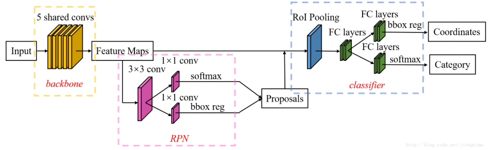
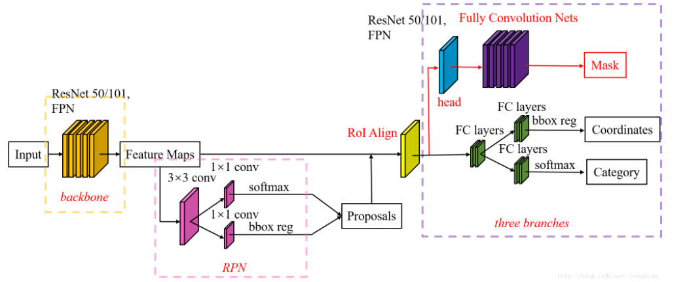
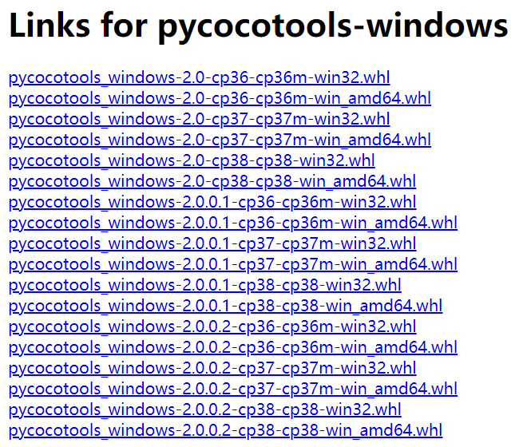
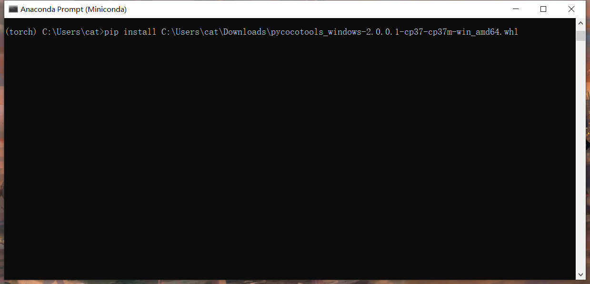
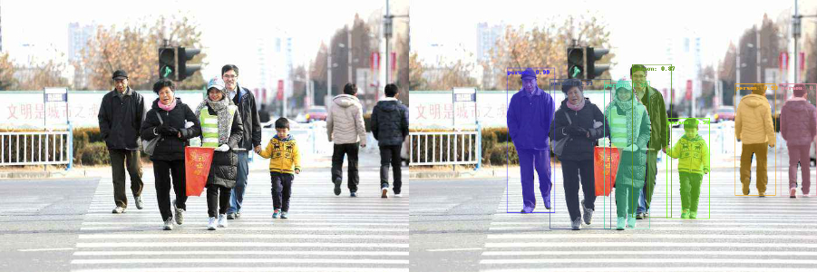

# Pytorch-Mask-RCNN
根据官方教程的简单实现，具体的过程了解可以参考[官网教程](https://pytorch.org/tutorials/intermediate/torchvision_tutorial.html)。

### 网络结构

**FasterRCNN结构**



&emsp;&emsp;如上图所示，Faster R-CNN的结构主要分为三大部分，第一部分是共享的卷积层-backbone，第二部分是候选区域生成网络-RPN，第三部分是对候选区域进行分类的网络-classifier。其中，RPN与classifier部分均对目标框有修正。classifier部分是原原本本继承的Fast R-CNN结构。

**MaskRCNN结构**



&emsp;&emsp;在Mask R-CNN中的RoI Align之后有一个"head"部分，主要作用是将RoI Align的输出维度扩大，这样在预测Mask时会更加精确。在Mask Branch的训练环节，作者没有采用FCN式的SoftmaxLoss，反而是输出了K个Mask预测图(为每一个类都输出一张)，并采用average binary cross-entropy loss训练，当然在训练Mask branch的时候，输出的K个特征图中，也只是对应ground truth类别的那一个特征图对Mask loss有贡献。  
​&emsp;&emsp;RoI Align的主要创新点是，**不再进行取整操作**，使用**双线性插值**来更精确地找到每个块对应的特征。总的来说，RoI Align的作用主要就是剔除了RoI Pooling的取整操作，并且使得为每个RoI取得的特征能够更好地对齐原图上的RoI区域。  


### 1. 基本环境需要

&emsp;&emsp;本人用Win10跑的代码，显卡RTX3060 6G，因为采用的时预训练的backbone(ResNet50 + FPN)，且数据集较小，所以对GPU没有过高的要求。

**没有提示安装的，按需要直接pip安装就可以了!!!!**

```
CUDA11
pip install pytorch == 1.11.0
torchvision == 0.12.0
```

### 2. pycocotools的安装

&emsp;&emsp;在整个过程中你要安装 pycocotools，主要用到其中的IOU计算的库来评价模型的性能。但是这个安装有点复杂，在安装过程中遇到了很多问题，但是通过下面的方法得到了解决。
1. 到这个[地址](https://pypi.tuna.tsinghua.edu.cn/simple/pycocotools-windows/)根据自己的电脑系统和python版本，找到与之相应的版本，然后把pycocotools对应版本的whl文件直接下载到本地。



2. 切换到相应的环境，直接 pip install 然后把下载的文件拖进命令行，直接回车即可!!!!!!



## 3. 运行

```python
# 开始训练
python train.py
# 指定GPU训练模型 
CUDA_VISIBLE_DIVICES= 这里写可用的GUP的序号(例如: 0,1,2,3) python train.py
# 修改 predict.py 里面的权重路径以及相关参数即可预测
python predict.py or predict_vison.py
```

##### 预测结果:




### ======================2022.08.09更新=========================

* 重新编写了预测脚本，且预测脚本采用不同的方式绘画最后的结果
  * predict.py 主要采用numpy的数据格式对后续结果进行处理和可视化
  * predict_vison.py 主要采用tensor的数据格式以及torchvision集成工具对后续结果进行处理和可视化
  * 相同条件下总花费时间 predict < predict_vision


* 将detect文件下的文件采用了torchvision中最新代码进行了替换和更改

  * **注：detection文件夹下同样可以进行直接训练，若想训练自己的数据集，直接度娘搜索“如何将数据转换成coco类型”即可！！！**


* 后续将会对maskrcnn的代码细节进行详细的注释和介绍！！！！
  * Faster RCNN 代码注释见 [awesome-object-detection/anchor-base/FasterRCNN](https://github.com/aotumanbiu/awesome-object-detection/tree/main/anchor-base/FasterRCNN) ！！！


### 补充

**示例数据集：**  
**[PennFudanPed](https://www.cis.upenn.edu/~jshi/ped_html/)**  下载并解压，然后把PennFudanPed文件夹直接放在与predict.py同级目录即可。

**权重下载：**  
**[MaskRCNN_9.pth](链接: https://pan.baidu.com/s/1n97fyrqYAOIS7dIB_NXgHw 提取码: dk8s )**

### 博客推荐

​		**1.     [实例分割模型Mask-RCNN网络原理与架构详解](https://blog.csdn.net/qq_27825451/article/details/89677068)**

​		**2.     [实例分割模型Mask R-CNN详解：从R-CNN，Fast R-CNN，Faster R-CNN再到Mask R-CNN](https://blog.csdn.net/jiongnima/article/details/79094159)**
